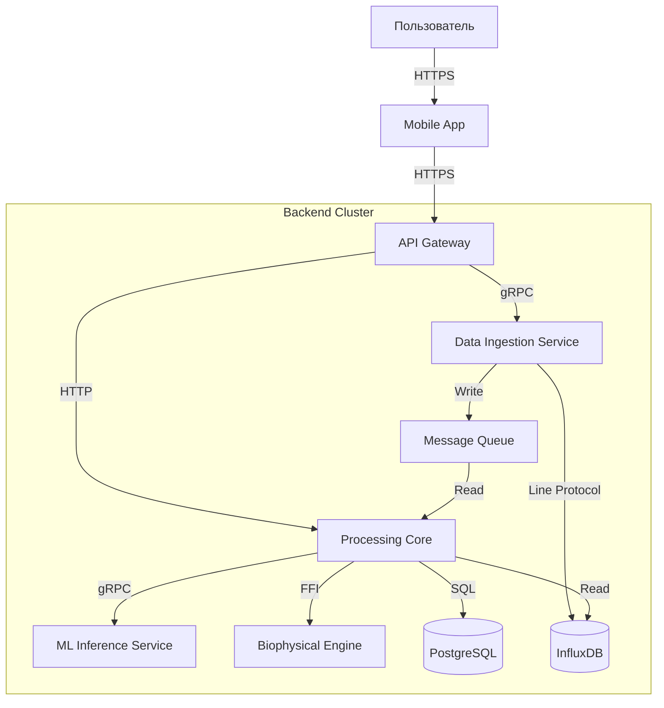

# Архитектура системы "Цифровой Двойник Здоровья"

## 1. Обзор (Context)
Система собирает данные с носимых устройств и медицинских карт пользователя, обрабатывает их с помощью ML-моделей и предоставляет персонализированные рекомендации по здоровью.

## 2. Контейнеры (Containers)

### 2.1. Mobile App (Flutter)
*   **Роль:** Основная точка входа для пользователя.
*   **Функции:** Отображение дашборда, получение уведомлений, ввод данных о питании.

### 2.2. API Gateway (Nginx)
*   **Роль:** Единая точка входа для всех запросов.
*   **Функции:** Маршрутизация, аутентификация, rate limiting.

### 2.3. Data Ingestion Service (Go)
*   **Роль:** Высокопроизводительный сервис сбора данных.
*   **Функции:** Прием потоков данных с датчиков (MQTT/HTTP), валидация, отправка в очередь.

### 2.4. Processing Core (Python/FastAPI)
*   **Роль:** Оркестрация обработки данных.
*   **Функции:** Запуск ML-пайплайнов, обновление состояния двойника.

### 2.5. ML Inference Service (TorchServe)
*   **Роль:** Исполнение нейросетевых моделей.
*   **Функции:** Прогнозирование уровня глюкозы, выявление аномалий ЭКГ.

### 2.6. Biophysical Engine (Rust)
*   **Роль:** Математическое моделирование физиологии.
*   **Функции:** Симуляция метаболических процессов на основе дифференциальных уравнений.

## 3. Хранение данных (Data Stores)

*   **InfluxDB:** Временные ряды (пульс, температура, шаги).
*   **PostgreSQL:** Профили пользователей, метаданные, история рекомендаций.
*   **Redis:** Кэширование, сессии, очереди задач (Celery broker).
*   **S3 (MinIO):** Хранение сырых данных (raw logs), моделей.

## 4. Диаграмма C4 (Level 2: Container)

## 5. Безопасность

*   **Шифрование:** TLS 1.3 для всех соединений. AES-256 для данных в покое (Data at Rest).
*   **Анонимизация:** Раздельное хранение PII (Personal Identifiable Information) и медицинских данных.
*   **Аутентификация:** OAuth 2.0 / OpenID Connect.
